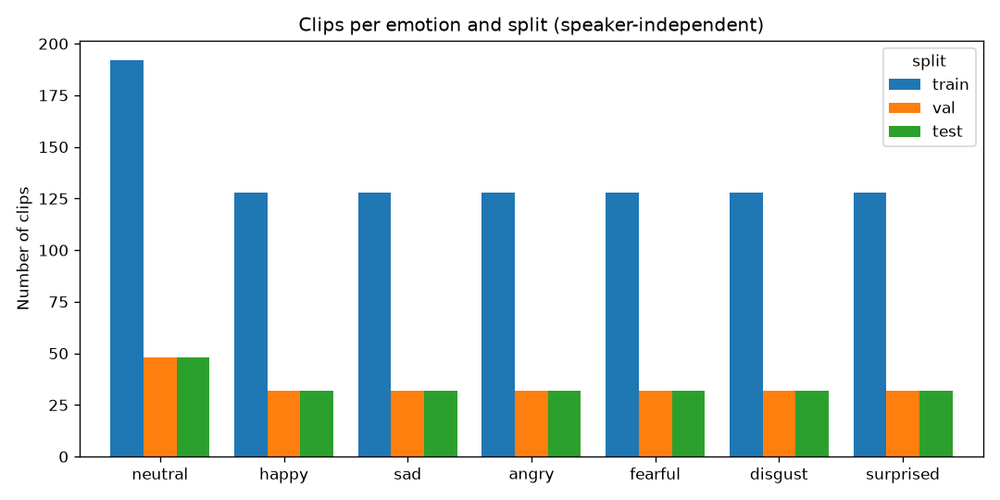
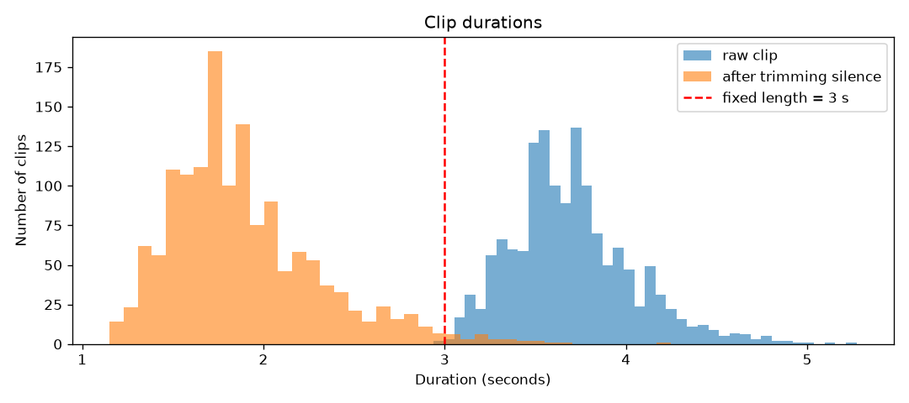
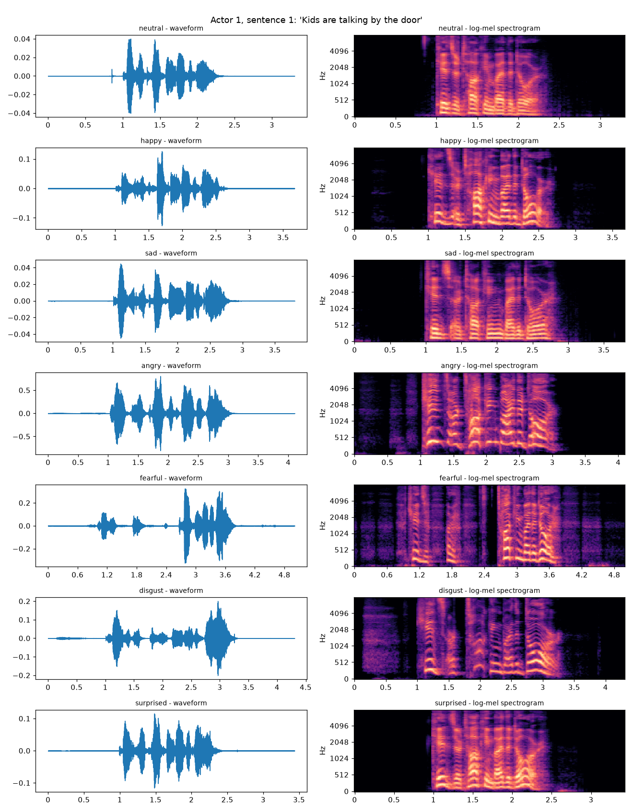
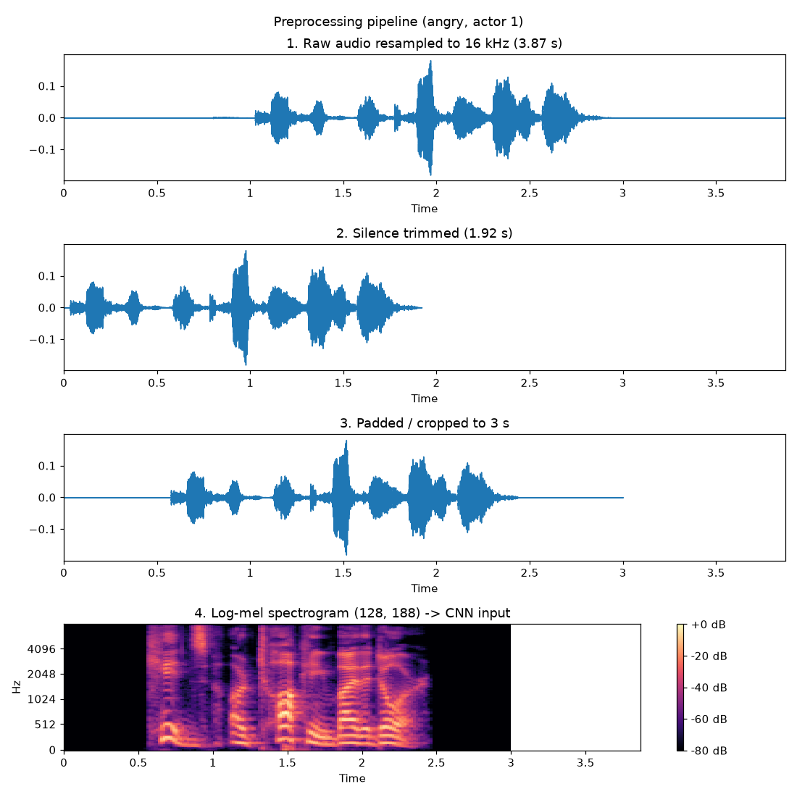
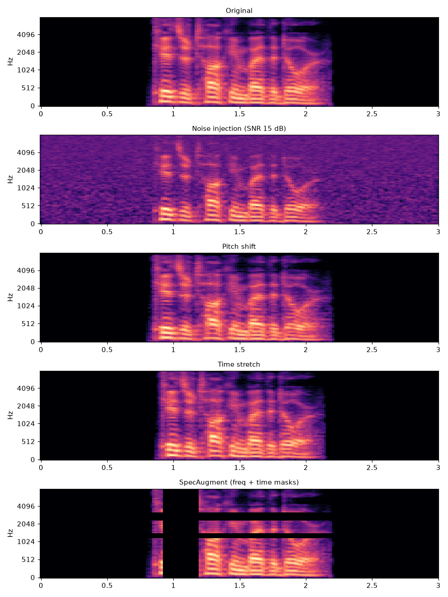

# Speech Emotion Recognition (SER) with a CNN

A CNN listens to a short voice clip and classifies the speaker's emotion:
**neutral, happy, sad, angry, fearful, disgust, surprised**.

Audio → log-mel spectrogram → 2D CNN → softmax over 7 emotions.

## Project plan

| Step | What | Status |
|---|---|---|
| 1 | Data preparation + EDA, speaker-independent split | ✅ |
| 2 | Preprocessing (trim, pad/crop, log-mel) + feature caching | ✅ |
| 3 | Augmentation (noise, pitch shift, time stretch, SpecAugment) | ✅ |
| 4 | CNN model + training (class weights, early stopping, checkpoints) | ⏳ |
| 5 | Evaluation (accuracy, macro F1, per-class metrics, confusion matrix) | ⏳ |
| 6 | Extensions: CNN-LSTM, leakage experiment, Streamlit demo | ⏳ |

## Dataset

[RAVDESS](https://zenodo.org/records/1188976): 1,440 speech clips, 24 professional actors
(12 male, 12 female), 2 sentences, 8 emotions. `calm` is merged into `neutral` → 7 classes.

### Speaker-independent split

| Split | Actors | Clips |
|---|---|---|
| train | 1–16 | 960 |
| val | 17–20 | 240 |
| test | 21–24 | 240 |

No actor appears in two splits. A random split would put the same voice (even the same
sentence) in train and test, so the model could recognise the *speaker* instead of the
*emotion*, and accuracy would be inflated.

## Setup

```bash
python -m venv .venv
.venv\Scripts\activate          # Windows  (Linux/Mac: source .venv/bin/activate)
pip install -r requirements.txt
```

## Run

```bash
python scripts/step1_prepare_data.py      # downloads RAVDESS, builds data/metadata.csv, EDA plots
python scripts/step2_extract_features.py  # trim, pad/crop to 3 s, log-mel -> data/features/*.npy
python scripts/step3_augment.py           # 3 augmented copies of every training clip
```

## Step 1 – EDA





Trimmed clips average 1.9 s and only 2.2% are longer than 3 s, so a fixed length of 3 s
keeps almost all speech while keeping every input the same size.

## Step 2 – Preprocessing

| Stage | Setting |
|---|---|
| Resample | 16 kHz, mono |
| Trim silence | everything 30 dB below the peak at start/end |
| Fixed length | 3 s (centre crop, or zero-pad on both sides) |
| Log-mel | n_fft 1024 (64 ms), hop 256 (16 ms), 128 mel bins → **128 × 188** |



## Step 3 – Augmentation

RAVDESS has only 960 training clips, so augmentation matters.

| Type | When | What |
|---|---|---|
| Noise injection | offline (cached) | white noise at SNR 15–30 dB |
| Pitch shift | offline (cached) | ±0.5–2 semitones |
| Time stretch | offline (cached) | 0.85×–1.15× speed (+ light noise) |
| SpecAugment | online, every batch | 2 frequency masks (≤15 bins) + 2 time masks (≤20 frames), p = 0.8 |

Training set: 960 original + 2,880 augmented = **3,840** spectrograms. Validation and test clips are never augmented.

Pitch shift and time stretch use a phase vocoder with a 32 ms window (`n_fft=512`).
librosa's default 128 ms window is too long for 16 kHz speech and visibly smears the harmonics.


