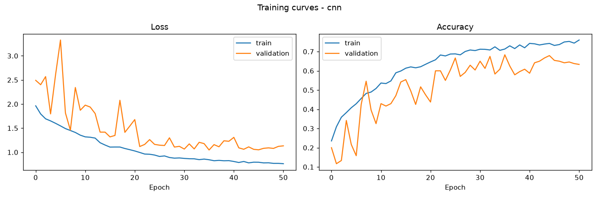
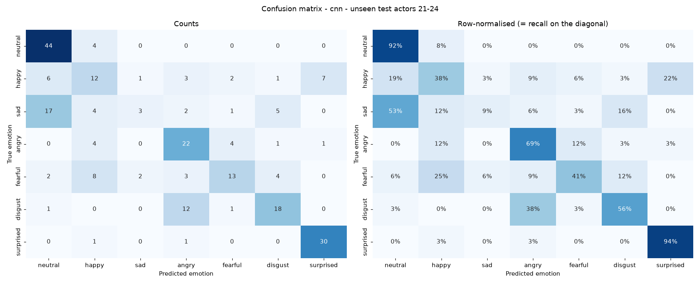

# Speech Emotion Recognition (SER) with a CNN

A CNN listens to a short voice clip and classifies the speaker's emotion:
**neutral, happy, sad, angry, fearful, disgust, surprised**.

Audio → log-mel spectrogram → 2D CNN → softmax over 7 emotions.

**Result on 4 unseen speakers: 59.2% accuracy, macro F1 0.54** (7 classes, chance = 14%).

## Project plan

| Step | What | Status |
|---|---|---|
| 1 | Data preparation + EDA, speaker-independent split | ✅ |
| 2 | Preprocessing (trim, pad/crop, log-mel) + feature caching | ✅ |
| 3 | Augmentation (noise, pitch shift, time stretch, SpecAugment) | ✅ |
| 4 | CNN model + training (class weights, early stopping, checkpoints) | ✅ |
| 5 | Evaluation (accuracy, macro F1, per-class metrics, confusion matrix) | ✅ |
| 6 | Extensions: CNN-LSTM, leakage experiment, Streamlit demo | ⏳ |

## Dataset

[RAVDESS](https://zenodo.org/records/1188976): 1,440 speech clips, 24 professional actors
(12 male, 12 female), 2 sentences, 8 emotions. `calm` is merged into `neutral` → 7 classes.

### Speaker-independent split

| Split | Actors | Clips |
|---|---|---|
| train | 1–16 | 960 |
| val | 17–20 | 240 |
| test | 21–24 | 240 |

No actor appears in two splits. A random split would put the same voice (even the same
sentence) in train and test, so the model could recognise the *speaker* instead of the
*emotion*, and accuracy would be inflated.

## Setup

```bash
python -m venv .venv
.venv\Scripts\activate          # Windows  (Linux/Mac: source .venv/bin/activate)
pip install -r requirements.txt
```

## Run

```bash
python scripts/step1_prepare_data.py      # downloads RAVDESS, builds data/metadata.csv, EDA plots
python scripts/step2_extract_features.py  # trim, pad/crop to 3 s, log-mel -> data/features/*.npy
python scripts/step3_augment.py           # 3 augmented copies of every training clip
python scripts/step4_train.py             # trains the CNN -> models/cnn.keras
python scripts/step5_evaluate.py          # metrics + confusion matrix on unseen test actors
```

## Step 1 – EDA


Trimmed clips average 1.9 s and only 2.2% are longer than 3 s, so a fixed length of 3 s
keeps almost all speech while keeping every input the same size.

## Step 2 – Preprocessing

| Stage | Setting |
|---|---|
| Resample | 16 kHz, mono |
| Trim silence | everything 30 dB below the peak at start/end |
| Fixed length | 3 s (centre crop, or zero-pad on both sides) |
| Log-mel | n_fft 1024 (64 ms), hop 512 (32 ms), 64 mel bins → **64 × 94** |


> I started with 128 × 188 inputs, but on a laptop CPU (i5-1235U, no GPU) one epoch took
> ~5.5 min. 64 × 94 is ~4× faster (2.8 s → 0.7 s per batch) and 64 mel bins is a standard
> choice for speech emotion, since prosody (pitch, energy, rhythm) does not need fine frequency detail.

## Step 3 – Augmentation

RAVDESS has only 960 training clips, so augmentation matters.

| Type | When | What |
|---|---|---|
| Noise injection | offline (cached) | white noise at SNR 15–30 dB |
| Pitch shift | offline (cached) | ±0.5–2 semitones |
| Time stretch | offline (cached) | 0.85×–1.15× speed (+ light noise) |
| SpecAugment | online, every batch | 2 frequency masks (≤8 bins) + 2 time masks (≤10 frames), p = 0.8 |

Training set: 960 original + 2,880 augmented = **3,840** spectrograms. Validation and test clips are never augmented.

Pitch shift and time stretch use a phase vocoder with a 32 ms window (`n_fft=512`).
librosa's default 128 ms window is too long for 16 kHz speech and visibly smears the harmonics.


## Step 4 – CNN model and training

```
Input 64 × 94 × 1 (normalised log-mel)
 ├─ Conv(32)  → BN → ReLU → MaxPool → Dropout 0.2   → 32 × 47
 ├─ Conv(64)  → BN → ReLU → MaxPool → Dropout 0.2   → 16 × 23
 ├─ Conv(128) → BN → ReLU → MaxPool → Dropout 0.3   →  8 × 11
 ├─ Conv(256) → BN → ReLU → MaxPool → Dropout 0.3   →  4 × 5
 ├─ GlobalAveragePooling → Dense(128) → Dropout 0.5
 └─ Dense(7, softmax)                                  423k parameters
```

| Setting | Value |
|---|---|
| Normalisation | per mel bin, mean/std from the clean training clips only |
| Optimiser | Adam, lr 1e-3, halved when val loss plateaus (patience 5) |
| Loss | sparse categorical cross-entropy + L2 1e-4 |
| Imbalance | balanced class weights (`neutral` has 1.5× clips) |
| Early stopping | on val accuracy, patience 15, restores best weights |
| Batch / epochs | 32 / max 60 |

Best **validation accuracy 68.3%** (epoch 36, stopped at epoch 51).



## Step 5 – Evaluation on unseen test actors (21–24)

| Metric | CNN |
|---|---|
| Accuracy | **59.2%** |
| Macro F1 | **0.542** |
| Weighted F1 | 0.556 |

| Emotion | Precision | Recall | F1 |
|---|---|---|---|
| neutral | 0.63 | 0.92 | 0.75 |
| happy | 0.36 | 0.38 | 0.37 |
| sad | 0.50 | 0.09 | 0.16 |
| angry | 0.51 | 0.69 | 0.59 |
| fearful | 0.62 | 0.41 | 0.49 |
| disgust | 0.62 | 0.56 | 0.59 |
| surprised | 0.79 | 0.94 | 0.86 |

Per actor: 56.7% (21, m), 68.3% (22, f), 50.0% (23, m), 61.7% (24, f).



### What the mistakes say

- **sad → neutral (17 of 32 sad clips).** Both are low-arousal: quiet, low pitch, little energy
  variation. The log-mel is scaled to each clip's own peak (`ref=np.max`), so the absolute loudness
  difference is removed and the model has to rely on subtler cues.
- **disgust → angry (12).** Both are negative, and disgust in RAVDESS is often voiced with the same tense, harsh timbre.
- **happy ↔ surprised / fearful.** All are high-arousal with high pitch; they differ mostly in pitch
  *contour*, which a CNN with global average pooling only partly captures (see the CNN-LSTM extension).
- **surprised (94%) and neutral (92%)** are the easiest: very distinctive rising pitch, and very flat delivery.
- Validation accuracy (68.3%) is higher than test accuracy (59.2%). With only 4 actors per split,
  individual speaking style matters a lot, so the numbers move by several points between speaker groups.
